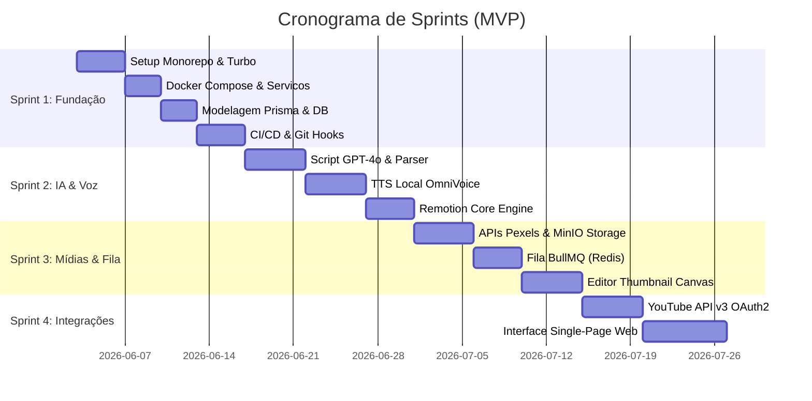

# Backlog de User Stories - Open Video Studio

Este documento organiza o desenvolvimento do **Open Video Studio** em sprints focadas em entregas funcionais e técnicas de valor, estruturado no modelo de Monorepo (Turborepo) e infraestrutura VPS self-hosted (Coolify/Docker Compose).

---

## Estrutura de Sprints & Sizing

---

## Sprint 1: Fundação & Infraestrutura Full-Stack (Configurações)

### US-INF-01: Setup do Monorepo com Turborepo, TSConfigs & Hoisting Estrito
* **Story:**
  Como desenvolvedor do projeto, quero configurar a estrutura de monorepo utilizando Turborepo (com cacheamento de envs), hoisting estrito e TSConfigs compartilhados, para que a integridade de dependências e builds de todas as aplicações seja centralizado e livre de efeitos colaterais.
* **Critérios de Aceite:**
  * O diretório raiz deve estar inicializado com Turborepo (`turbo.json` configurado).
  * O `turbo.json` deve mapear as variáveis de ambiente críticas (ex: `DATABASE_URL`, `NEXT_PUBLIC_API_URL`) para invalidar e recriar o cache de compilação quando os valores mudarem na VPS.
  * O workspace do pnpm deve operar com **Hoisting Estrito** (sem `shamefully-hoist=true` no `.npmrc`), garantindo que cada sub-projeto declare suas próprias dependências explícitas.
  * Criação de pacotes compartilhados: `packages/tsconfig` (configs base TypeScript) e `packages/eslint-config` (regras lint).
  * Criação das aplicações: `apps/web` (Next.js), `apps/backend-node` (Fastify com TypeScript estrito) e `apps/backend-python` (FastAPI com **Poetry**).
* **Tarefas Técnicas:**
  * Inicializar workspace do pnpm (`pnpm-workspace.yaml`).
  * Configurar `turbo.json` com mapeamento de `globalEnv` e `env` por tarefa.
  * Inicializar projeto Poetry em `apps/backend-python/pyproject.toml`.

### US-INF-02: Serviços Containerizados & Validação de Ambiente (Zod)
* **Story:**
  Como arquiteto do sistema, quero definir a infraestrutura de serviços via Docker Compose e criar esquemas de validação Zod para variáveis de ambiente, para que a inicialização do projeto falhe imediatamente (fail-fast) se houver alguma configuração incorreta de credenciais ou portas.
* **Critérios de Aceite:**
  * O arquivo `docker-compose.yml` deve expor as portas de PostgreSQL (`5432`), Redis (`6379`) e MinIO (`9000` API, `9001` Console).
  * Cada aplicação (`apps/web` e `apps/backend-node`) deve carregar e validar o `.env` no startup através de um schema do **Zod**, lançando erro impeditivo em caso de falha.
* **Tarefas Técnicas:**
  * Escrever `docker-compose.yml` com variáveis persistidas localmente.
  * Implementar módulo utilitário de validação de ambiente com Zod no backend e frontend.

### US-INF-03: Modelagem de Dados (Prisma ORM) & Compatibilidade Docker
* **Story:**
  Como desenvolvedor backend, quero configurar o Prisma ORM e os alvos de binários de compatibilidade de SO, para rodar migrations e queries de banco de dados com segurança tanto no desenvolvimento local quanto no container Docker na VPS do Coolify.
* **Critérios de Aceite:**
  * Configurar `binaryTargets = ["native", "debian-openssl-1.1.x", "linux-musl-openssl-3.0.x"]` no `schema.prisma` para compatibilidade entre macOS/Windows de desenvolvimento e o container Linux (Debian/Alpine) do Coolify.
  * Mapeamento de tabelas: `Channel` (tokens OAuth2), `VoiceProfile` (perfis TTS), `Project` (roteiro) e `Scene` (blocos de cena).
  * O pipeline de deploy do Coolify deve rodar `prisma migrate deploy` na etapa de build/pre-deploy.
* **Tarefas Técnicas:**
  * Escrever o `schema.prisma` com `binaryTargets`.
  * Configurar scripts de migrations no monorepo.

### US-INF-04: CI/CD Pipeline (Coolify Webhook) & Git Hooks (Vitest / Pytest)
* **Story:**
  Como engenheiro DevOps, quero configurar git hooks locais e uma pipeline CI/CD via GitHub Actions com verificações estritas, para garantir que o deploy via webhook do Coolify só ocorra se o código estiver 100% tipado (sem `any`), formatado e testado.
* **Critérios de Aceite:**
  * **Git Hooks locais:** Husky + Lint-staged configurados no pre-commit executando apenas ESLint e Prettier nos arquivos em staging.
  * **CI/CD Pipeline (GitHub Actions):**
    * Executa checagem de tipos estrita (TypeScript strict mode, proibido tipo `any`).
    * Executa a suite de testes TDD: **Vitest** para aplicações Node/Web e **Pytest** para Python backend, integrados ao comando `turbo run test`.
    * Caso todas as etapas do runner self-hosted passem, envia uma requisição HTTP POST (Webhook) para o Coolify disparar o deploy na Hostinger VPS.
* **Tarefas Técnicas:**
  * Configurar Husky e lint-staged no monorepo.
  * Escrever `.github/workflows/deploy.yml` configurado para o runner self-hosted.

---

## Sprint 2: Inteligência Artificial & Voz

### US-AI-01: Geração de Roteiro Dinâmico & Parser de Cenas
* **Story:**
  Como criador de conteúdo, quero inserir um tema na plataforma e obter um roteiro estruturado por IA que seja dividido automaticamente em cenas, para que eu possa editá-lo de forma simplificada.
* **Critérios de Aceite:**
  * Endpoint em `backend-node` conectado ao OpenAI GPT-4o.
  * O prompt da IA deve estruturar o roteiro delimitando as cenas por tags claras (ex: `[CENA X]`).
  * O backend deve processar a resposta e salvar o roteiro no banco de dados, criando registros de `Scene` para cada tag encontrada.
* **Tarefas Técnicas:**
  * Implementar integração com OpenAI SDK.
  * Criar algoritmo de regex/parsing de tags de cena em Node.js.

### US-AI-02: Narração TTS Segmentada por Cenas (Python Backend)
* **Story:**
  Como criador de conteúdo, quero que o sistema gere a narração de voz para cada cena individualmente a partir do texto do roteiro usando perfis de voz clonados locais, para otimizar o tempo de regeneração de áudios.
* **Critérios de Aceite:**
  * Endpoint em `backend-python` (FastAPI) que receba um texto e o ID da voz do canal.
  * Geração local de áudio (`.wav`/`.mp3`) de alta fidelidade rodando OmniVoice Studio localmente.
  * Gravação dos arquivos de áudio de forma indexada por cena no storage (MinIO).
* **Tarefas Técnicas:**
  * Configurar runtime Python com dependências do OmniVoice Studio (coqui-tts/similar).
  * Expor API de síntese e integração com MinIO SDK em Python.

### US-AI-03: Engine de Composição no Remotion
* **Story:**
  Como editor de vídeo, quero que o Remotion combine programaticamente os arquivos de áudio de narração, as legendas geradas e as marcações temporais das cenas, para gerar a estrutura inicial do vídeo completo.
* **Critérios de Aceite:**
  * O pacote `packages/remotion-video` deve conseguir ler o JSON estruturado de um projeto.
  * Renderizar as cenas em sequência horizontal linear.
  * Gerar legendas animadas sobrepostas e sincronizadas com a duração exata do áudio de cada cena.
* **Tarefas Técnicas:**
  * Escrever componentes React no Remotion para ler a estrutura de `Scenes`.
  * Integrar lógica de sincronização temporal (áudio duration -> frame duration).

---

## Sprint 3: Mídias, Armazenamento & Fila de Renderização

### US-MED-01: Integração de APIs de Stock & MinIO Storage
* **Story:**
  Como produtor de vídeo, quero que a IA busque automaticamente fotos e vídeos de stock baseados no roteiro e permita que eu faça uploads de gravações próprias, para compor o visual das cenas.
* **Critérios de Aceite:**
  * Serviço de integração com Pexels API e Pixabay API para realizar consultas por palavras-chave e retornar sugestões visuais.
  * Container MinIO configurado para receber uploads de mídias de usuários e armazenar assets do projeto de forma organizada por canal.
* **Tarefas Técnicas:**
  * Criar rotas de busca de mídias e rotas assinadas (presigned URLs) para upload direto ao MinIO.

### US-MED-02: Fila de Jobs de Render (BullMQ)
* **Story:**
  Como gestor do sistema, quero enfileirar as solicitações de renderização de vídeos usando BullMQ e Redis, para que o processador FFmpeg rode de forma sequencial na VPS sem estourar os recursos de CPU e memória RAM.
* **Critérios de Aceite:**
  * Fila de jobs implementada via BullMQ conectada ao Redis.
  * Somente 1 renderização simultânea de vídeo por canal é permitida por worker do backend.
  * O status da renderização ("Aguardando na Fila", "Renderizando", "Concluído", "Falha") deve ser salvo e transmitido via WebSockets.
* **Tarefas Técnicas:**
  * Configurar fila BullMQ em `backend-node`.
  * Escrever worker de execução remota de render do Remotion CLI.

### US-MED-03: Editor de Thumbnail Multicamadas
* **Story:**
  Como designer do canal, quero criar e editar graficamente a capa do vídeo através de uma interface de canvas interativa, para maximizar o CTR dos lançamentos sem sair da plataforma.
* **Critérios de Aceite:**
  * Mesa de trabalho de canvas interativa (proporção 1280x720px) com suporte a arrastar e redimensionar elementos.
  * Camadas empilháveis controladas pelo usuário (Fundo IA, recortes PNG transparentes de reação, formas, setas de destaque e caixas de texto com estilo).
  * Botão de exportação que gera o arquivo PNG/JPG final otimizado (< 2MB).
* **Tarefas Técnicas:**
  * Criar componente de Canvas Interativo (usando Fabric.js ou Canvas API padrão) em React no Next.js.
  * Rota no backend para gerar imagem de fundo via IA Text-to-Image.

---

## Sprint 4: Integrações, Publicação & Dashboard

### US-PUB-01: Conexão OAuth2 & Publicação Automatizada (YouTube API)
* **Story:**
  Como criador de conteúdo, quero conectar meus canais do YouTube usando o login do Google e agendar a publicação automática dos vídeos gerados, para automatizar completamente a minha esteira de publicação.
* **Critérios de Aceite:**
  * Fluxo de autenticação OAuth2 do Google implementado, armazenando os access e refresh tokens no banco local.
  * Formulário de preenchimento de metadados de publicação (Título, Descrição, Tags e Thumbnail).
  * Scheduler de publicação que envia o vídeo na data e hora selecionadas pelo usuário utilizando a YouTube Data API v3.
* **Tarefas Técnicas:**
  * Implementar rotas OAuth de callback.
  * Escrever serviço de cron/agenda que executa o upload do arquivo de vídeo salvo no MinIO para o YouTube.

### US-PUB-02: Interface Web da Área de Trabalho Unificada (Single-Page)
* **Story:**
  Como usuário da plataforma, quero gerenciar o roteiro, a linha do tempo das cenas, a thumbnail e as configurações de publicação em uma única tela de 3 colunas de alto contraste, para obter máxima produtividade na criação.
* **Critérios de Aceite:**
  * Desenvolvimento da interface conforme o documento de [ux_map.md](file:///C:/Users/mac/Documents/open-video-studio/ux_map.md).
  * A tela deve conter:
    * Coluna Esquerda: Editor de roteiro interativo com badges de cena.
    * Coluna Central: Remotion Video Player integrado e Linha do tempo horizontal rolável com blocos de duração proporcional.
    * Coluna Direita: Seletor de vozes, mini preview da thumbnail (clicar abre modal de edição canvas), metadados de publicação e botões de ação final.
  * Tema visual Dark Mode com transições suaves e design premium de alto contraste.
* **Tarefas Técnicas:**
  * Desenvolver os painéis da dashboard em Next.js.
  * Integrar chamadas de API com Tailwind CSS / CSS Modules estruturados.
