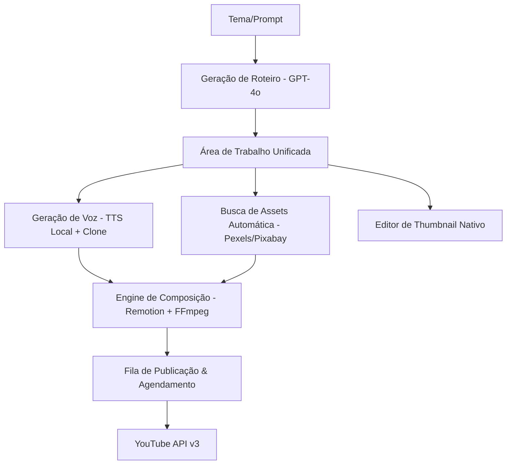
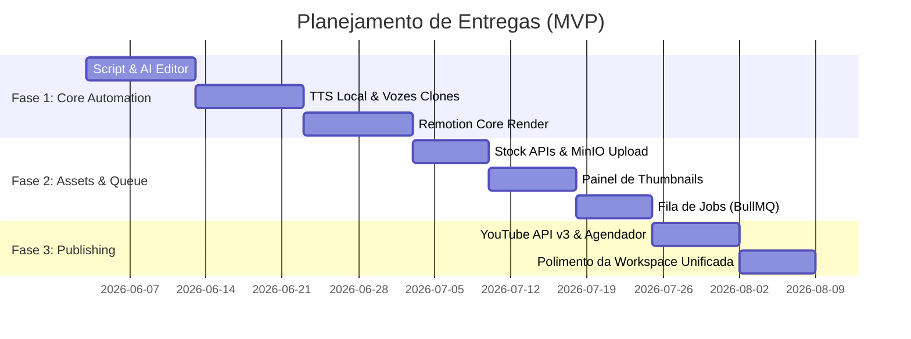

# PRD - Open Video Studio: AI-Powered YouTube Video Creator 100% Automatizado

Este Documento de Requisitos do Produto (PRD) detalha a finalidade, as funcionalidades, as regras de negócio e o comportamento do **Open Video Studio**, servindo como guia fundamental para as equipes de design e engenharia no desenvolvimento do MVP.

---

## 1. Visão Geral do Produto

O **Open Video Studio** é uma plataforma *full-stack* de criação de vídeos para YouTube, totalmente automatizada por inteligência artificial. O usuário fornece um tema e a plataforma gerencia o ciclo completo de produção: geração de roteiro com técnicas de retenção, narração via TTS local com clonagem de voz, enriquecimento visual autônomo com mídias royalty-free e gravações do usuário, composição de vídeo programática via **Remotion** e publicação direta no YouTube.

---

## 2. Problema & Público-Alvo

### O Problema
* **Alto custo e lentidão:** Produzir vídeos profissionais exige uma equipe multidisciplinar (roteiristas, locutores, editores).
* **Fragmentação:** Criadores precisam usar várias ferramentas isoladas para roteiro, áudio e vídeo, sem um fluxo unificado.
* **Escalabilidade limitada:** Um produtor solo ou pequena agência não consegue produzir múltiplos vídeos semanais com qualidade consistente sem automação.

### Público-Alvo (MVP)
* **Criadores Solo e Proprietários de Canais:** Foco em automatizar a produção e publicação em massa para canais próprios de conteúdo no YouTube, otimizando o fluxo de trabalho pessoal.

### Benefícios ao Usuário Final
* **Redução Drástica de Custos:** Elimina custos recorrentes de APIs de voz comerciais de alta qualidade (como ElevenLabs) e de freelancers de edição/roteiro.
* **Ganho de Escala Temporal:** Reduz o tempo de confecção de um vídeo completo de dias para menos de 15 minutos, permitindo focar na estratégia e análise de métricas dos canais.
* **Padronização Técnica:** Garante que todos os vídeos gerados respeitem os mesmos padrões estéticos (Brand Kit, estilos de legenda, ritmo e hooks de retenção) do respectivo canal.

---

## 3. Objetivos do Produto & KPIs (Métricas de Sucesso)

### Objetivos Principais
* Gerar um vídeo completo (roteiro, narração, composição visual e legenda) em **menos de 15 minutos**.
* Maximizar a retenção do público com roteiros estruturados em técnicas comprovadas (PSA, Hook Forte, Loops Abertos).
* Garantir custo zero de API de voz utilizando **TTS local com clonagem de voz**.
* Proporcionar um fluxo de trabalho ultra-rápido através de uma **Área de Trabalho Unificada (Single-Page)**.

### Métricas de Sucesso (KPIs)
* **Tempo de Geração (End-to-End):** Tempo médio desde a inserção do tema até o vídeo estar pronto para publicação inferior a 15 minutos.
* **Volume de Vídeos por Semana:** Meta de produção de mais de 10 vídeos por semana por canal com intervenção mínima.
* **Fidelidade de Rendering:** Taxa de falhas ou crash de render do Remotion inferior a 2%.
* **Taxa de Ativação:** O criador deve conseguir criar, visualizar e agendar o primeiro vídeo em menos de 20 minutos de uso inicial.

### Como Medir o Sucesso (Instrumentação)
Para acompanhar a eficiência do lançamento do MVP, a equipe medirá os KPIs através de:
* **Mapeamento de Logs e Telemetria no Backend:** Registro do timestamp de início e fim de cada etapa do pipeline (IA Script, TTS Voice, Render Remotion, Upload MinIO/YouTube) em banco de dados local.
* **Monitoramento da Fila Redis/BullMQ:** Painel administrativo (Bull Board) para rastrear o número de jobs completados com sucesso e taxa de falhas/erros de renderização em tempo real.
* **Auditoria de Canal:** Relatório semanal gerado de forma interna com o número de uploads agendados e publicados com sucesso via API no YouTube Studio.

---

## 4. Arquitetura Funcional do Sistema

---

## 5. Funcionalidades Detalhadas & Critérios de Aceite

### Módulo 1: Geração e Edição de Roteiro (IA)
* **Descrição:** Entrada de Tema, Tom e Duração para gerar um roteiro otimizado.
* **Comportamento:** O roteiro gerado é apresentado em um editor de texto contínuo livre (estilo Notion). O sistema faz o parsing de blocos/cenas usando marcações do tipo `[CENA X]`. O usuário pode solicitar alterações no texto selecionado usando comandos de IA ou editar livremente.
* **Regra de Geração:** A estrutura e as técnicas de retenção são decididas de forma **100% autônoma pela IA** com base no tema e nicho do canal inserido.
* **Critérios de Aceite:**
  * O editor deve atualizar em tempo real a duração estimada do vídeo com base no número de palavras do roteiro (média de 130-150 palavras por minuto).
  * O usuário deve ter um botão "Ajustar com IA" para digitar instruções (ex: "torne o hook inicial mais curto e misterioso") e atualizar o roteiro livremente.
  * O sistema faz o parsing dinâmico das cenas caso o usuário altere as marcações `[CENA X]`.

### Módulo 2: Narração com TTS e Biblioteca de Vozes
* **Descrição:** Criação de perfis de voz clonados e geração de narração PT-BR local sem custos adicionais de API.
* **Comportamento:** Permite treinar vozes a partir do envio de uma amostra de áudio (10s a 5min). O usuário escolhe a voz na biblioteca de perfis no início de cada projeto.
* **Regra de Geração:** O sistema gera **arquivos de áudio individuais separados por cena** (ex: `cena1.mp3`, `cena2.mp3`). Se o usuário editar o texto de apenas uma cena, apenas o áudio daquela cena específica é regenerado.
* **Critérios de Aceite:**
  * O sistema deve listar as vozes salvas na biblioteca de perfis.
  * O player de áudio deve permitir dar "Play Preview" em blocos de texto antes de renderizar o vídeo inteiro.
  * O áudio gerado deve ser salvo em formato `.wav` ou `.mp3` de alta qualidade (mínimo 22kHz, mono).

### Módulo 3: Upload e Gestão de Assets (Imagens, Vídeos e Músicas)
* **Descrição:** Enriquecimento visual autônomo e manual das cenas do vídeo.
* **Comportamento:** A IA lê o roteiro, extrai palavras-chave e faz buscas de mídias royalty-free nas APIs Pexels/Pixabay/Unsplash, associando-as às cenas correspondentes.
* **Regra de Fallback e Comportamento:**
  * O sistema prioriza vídeos de stock (5-15s). 
  * Se não encontrar vídeos relevantes, utiliza uma imagem estática e aplica um efeito dinâmico de zoom/pan (Ken Burns Effect) via Remotion.
  * Se não houver mídias para a palavra-chave pesquisada, o bloco correspondente fica vazio/cor sólida do canal e exibe um alerta solicitando que o usuário faça upload manual ou altere a palavra de busca.
* **Critérios de Aceite:**
  * Cada bloco do roteiro identificado pelo parser deve receber pelo menos uma sugestão visual da IA ou um placeholder claro em caso de falha de busca.
  * O usuário deve conseguir arrastar e soltar (drag and drop) arquivos locais de vídeo/imagem para substituir o asset de uma cena específica.
  * A música de fundo deve ter a opção de volume ajustável e ducking automático (o volume da trilha diminui 80% quando a narração de voz está tocando).

### Módulo 4: Composição de Vídeo com Remotion
* **Descrição:** Engine de vídeo programática que renderiza o projeto combinando voz, mídias, transições e legendas.
* **Comportamento:** Aplica as configurações visuais do Brand Kit do canal.
* **Estilo de Legenda Livre:** O usuário pode configurar a legenda do zero no Brand Kit de cada canal (definindo fonte do Google Fonts, tamanho exato, cor do texto, cor da borda, espessura da sombra e tipo de animação).
* **Critérios de Aceite:**
  * As legendas automáticas devem ter precisão de sincronia palavra por palavra ou linha por linha, com desalinhamento máximo de 100ms.
  * O vídeo final deve ser exportado em formato 16:9 (1920x1080) ou vertical 9:16 (YouTube Shorts).
  * A logo/marca d'água deve ser renderizada em local fixo (ex: canto superior direito) com opacidade configurável no Brand Kit.

### Módulo 5: Editor Nativo de Thumbnails
* **Descrição:** Geração de capas com IA Text-to-Image e edição visual direta.
* **Comportamento:** Cria automaticamente uma imagem de fundo chamativa e insere um texto programático baseado no título e Brand Kit. Abre um editor gráfico dinâmico.
* **Estrutura Multicamadas:** O editor opera com canvas multicamadas interativo. O usuário pode adicionar/editar textos, formas/setas, caixas de destaque, e fazer upload de recortes de imagens transparentes (PNG), ajustando livremente o tamanho, rotação e ordem de empilhamento (z-index).
* **Critérios de Aceite:**
  * O editor deve permitir ao usuário: mover o texto, alterar a cor de preenchimento, alterar a borda do texto, ajustar o tamanho da fonte e fazer upload de uma imagem com transparência (ex: foto de reação) para sobrepor.
  * O botão de exportação deve gerar a imagem exatamente na proporção 1280x720px, formato PNG ou JPG, com tamanho inferior a 2MB (requisito do YouTube).

### Módulo 6: Exportação, Revisão e Publicação
* **Descrição:** Validação final e envio automático para o canal do YouTube via API.
* **Comportamento:** Fila de revisão centralizada com preview do vídeo e edição dos metadados finais.
* **Conexão Multicanal OAuth2:** O usuário pode conectar múltiplas contas e canais do YouTube através de um fluxo Google OAuth2 nas configurações do app. No momento da publicação, escolhe qual canal associado receberá o vídeo.
* **Critérios de Aceite:**
  * O usuário deve conseguir visualizar o vídeo completo (player HTML5) e a thumbnail lado a lado.
  * Deve permitir agendar a publicação especificando Data (DD/MM/AAAA) e Hora (HH:MM) no fuso horário local.
  * O status do upload ("Enviando", "Processando no YouTube", "Agendado", "Publicado") deve ser exibido claramente.

---

## 6. Regras de Negócio & Restrições Técnicas

### Regras de Negócio Críticas
1. **Isolamento de Brand Kits:** Cada canal cadastrado deve ter seu próprio Brand Kit exclusivo (fontes, paleta de cores e marcas d'água). A alteração em um canal não pode afetar os outros.
2. **Sincronização Obrigatória:** A composição não pode ser enviada para renderização no Remotion se o arquivo de áudio da narração da respectiva cena estiver ausente ou corrompido.
3. **Limitação de Rendering Paralelo:** Devido à infraestrutura baseada em VPS Hostinger local, o sistema deve processar apenas **1 render de vídeo por vez por canal** para evitar estouro de memória RAM e sobrecarga de CPU. Projetos subsequentes devem entrar na fila Redis/BullMQ com status "Aguardando".

### Restrições Técnicas
* **Infraestrutura:** VPS Hostinger gerenciada via Coolify. Sem dependência de serviços serverless externos de vídeo (AWS MediaConvert/Lambda).
* **Storage:** Armazenamento local de mídias e assets temporários via MinIO (S3 compatível) rodando na própria VPS.
* **Limites de Upload:** Arquivos de vídeo enviados pelo usuário para compor cenas devem ter no máximo 200MB e formato `.mp4` ou `.mov`.
* **API YouTube:** Tratamento do limite de cotas diárias da YouTube Data API v3 (10.000 unidades/dia). Se o limite for atingido, a plataforma deve alternar automaticamente para o modo "Apenas Download" com um aviso amigável.

---

## 7. Detalhes de Design e UX

### Layout da Área de Trabalho Unificada (Single-Page)
A tela de edição foi projetada para fluxo rápido de trabalho sem navegação em abas:
* **Tema Visual:** Dark Mode nativo com estética premium e cores escuras de alto contraste (cinza chumbo, detalhes em azul vibrante/neon e roxo).
* **Visualização Fixo-Desktop:** A tela será otimizada para monitores Full HD (1920x1080), bloqueando o uso responsivo em mobile no MVP (fora do escopo).
* **Estrutura de 3 Colunas:**
  * **Painel Esquerdo (Escrita e IA):** Editor de Roteiro (Notion-like) + Painel lateral de comandos rápidos de IA.
  * **Painel Central (Visual e Mídias):** Player de preview do vídeo + Timeline de Cenas com o Grid de Assets (fotos/vídeos de cada cena) + Selecionador de Músicas de Fundo.
  * **Painel Direito (Branding e Publicação):** Configuração do Brand Kit/Voz + Editor Interativo de Thumbnail + Formulário de Metadados de Publicação (Título, Tags, Agendador).

---

## 8. Casos de Borda e Tratamento de Erros

* **Falha de Conexão com API de Stock (Pexels/Pixabay):**
  * *Comportamento:* Se a API de busca de mídias falhar ou não encontrar resultados, o sistema deve inserir um asset padrão (fundo de cor sólida baseado no Brand Kit do canal com uma animação geométrica sutil).
* **Amostra de Voz Insuficiente para Clonagem:**
  * *Comportamento:* Se o áudio enviado para clonagem tiver ruído excessivo ou menos de 10 segundos, o sistema deve rejeitar o upload e sugerir uma gravação direta pelo microfone com instruções na tela.
* **Queda do Renderizador Remotion no meio do Job:**
  * *Comportamento:* A fila Redis/BullMQ deve registrar a falha do job, liberar os recursos de memória, atualizar o status do projeto no painel para "Erro na Renderização" e oferecer ao usuário um botão "Tentar Novamente".

---

## 9. Modelo de Operação (Business Model do MVP)

Para este MVP, o modelo de negócios baseia-se em **Otimização de Custos e Escala Interna (Uso Privado)**:
* **Monetização Indireta:** O retorno financeiro é gerado através do tráfego e visualizações (AdSense e Afiliados) dos canais do próprio criador que são alimentados de forma massiva pela ferramenta.
* **Eficiência Operacional:** O principal KPI financeiro é o custo de produção de conteúdo tendendo a zero (visto que o processamento do TTS e do vídeo é feito 100% localmente na VPS Hostinger, eliminando taxas de APIs de terceiros).
* **Escalabilidade Sem Contratações:** Permite ao proprietário gerenciar e alimentar dezenas de canais do YouTube sem a contratação de freelancers ou equipe interna.

---

## 10. Roadmap de Desenvolvimento (Visão MVP)

